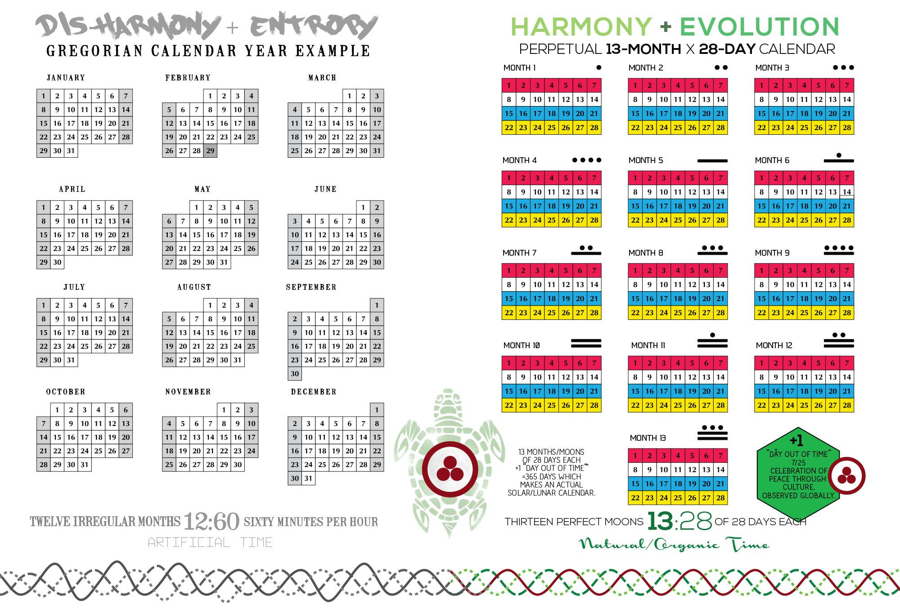

# The length of a year jumps by 1/4th of. a rotation to 365.25 days

The *year's length* would no longer undergo significant changes as Earth's orbital period
would remain constant in the future. This allowed for the formation of the first
[fixed lunisolar calendar](https://en.wikipedia.org/wiki/International_Fixed_Calendar).
One problem to solve in the *fixed* calendar is how to count the number of years 'since *creation*'. As the
length of the year changed many times, date ranges that span events during *creation* are inherently _inconsistent_.
Therefore, the solution to this problem is to assign a label to each date indicating whether the year occurred *before*
the Common Era **(B.C.E.)**, or *afterward* during the Common Era **(C.E.)**.

