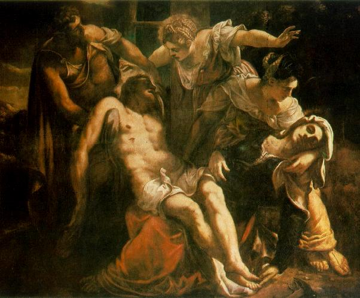

# Historical Christ is Crucified in Istanbul

With the planetary orbits stable for over a hundred years, it was now possible for the first time to predict future
eclipses. The date and time of the crucifixion was purposefully chosen on a solar eclipse to magnify the psychological
impact of the event. To the medieval mind it meant that God passed over the judgment and did not intervene to save
someone claiming to be his Son. This lie sufficed and his followers scattered in fear. The crucifixion of Christ was
designed to end the influence of Giants like Christ by allowing the smaller humans to poke, stab, and laugh at the
giants with impunity while they were bound to the crosses.

